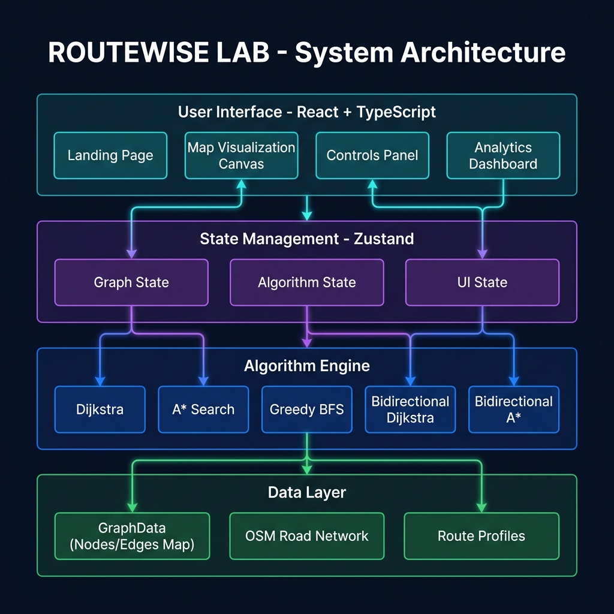
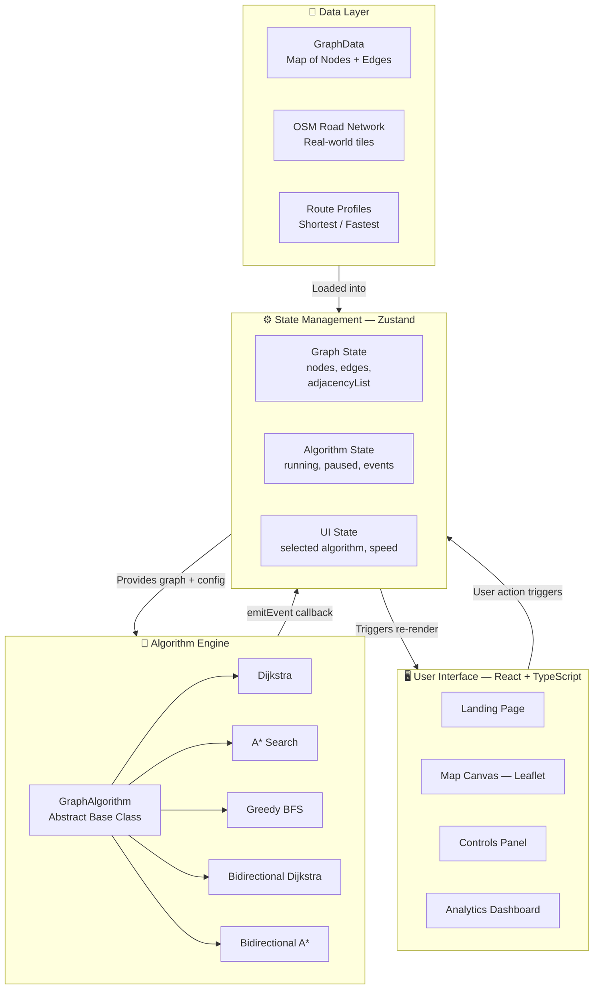
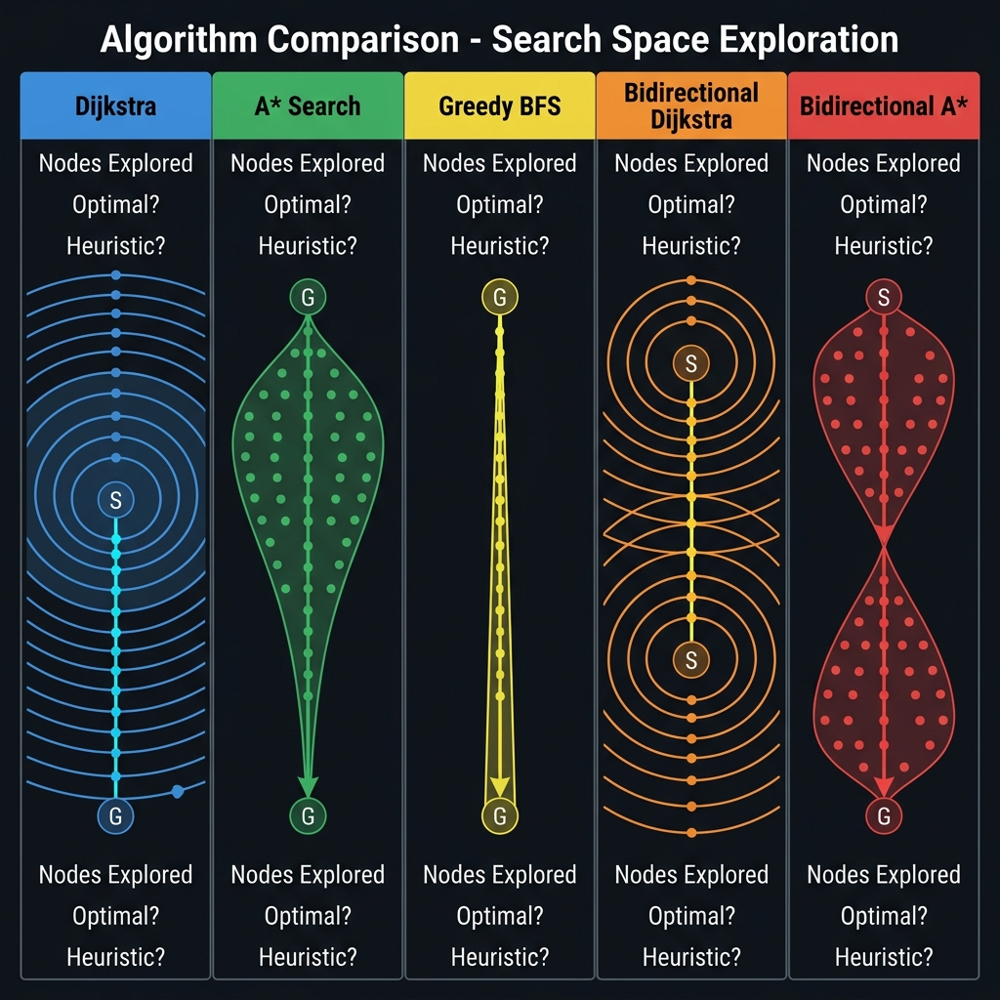
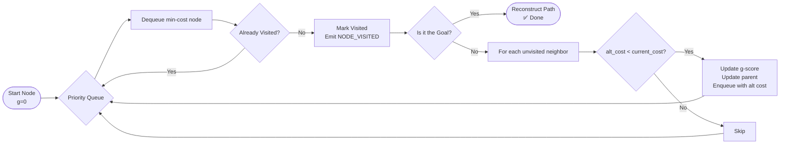
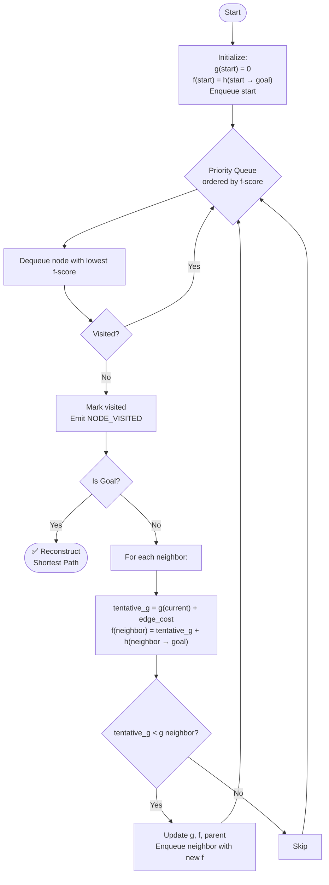
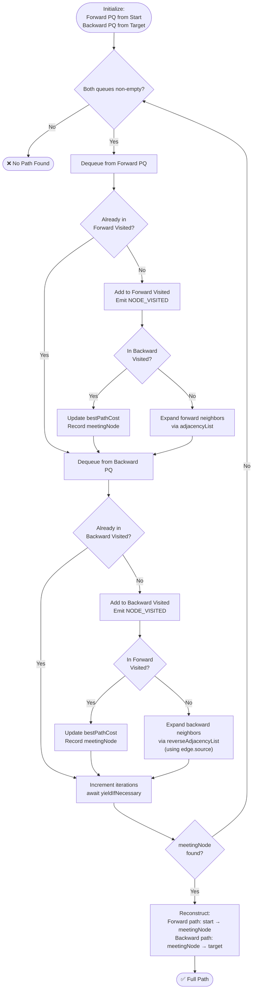
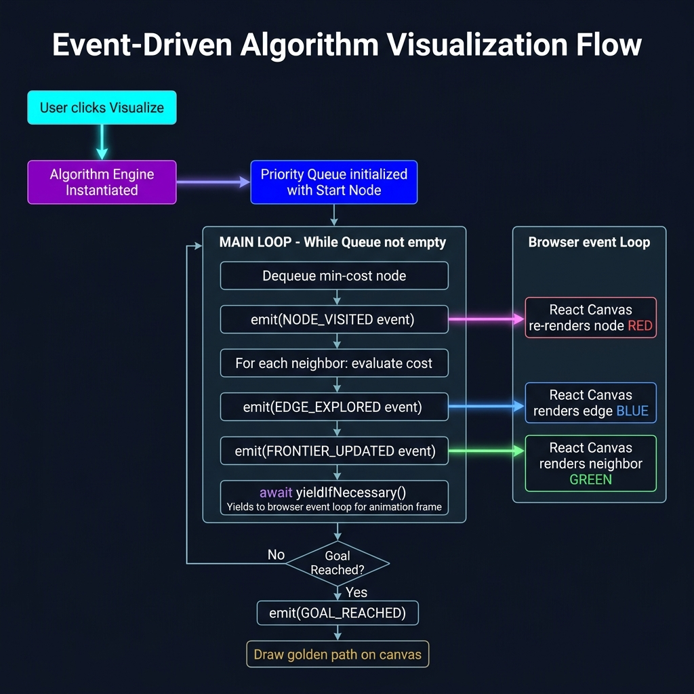

<div align="center">

# 🗺️ ROUTEWISE LAB

### A Flagship Real-World Graph Algorithm Visualization Platform

*From theory on a whiteboard to algorithms running live on a real road network.*

[](https://reactjs.org/)
[](https://www.typescriptlang.org/)
[](https://vitejs.dev/)
[](https://tailwindcss.com/)
[](https://leafletjs.com/)
[](https://zustand-demo.pmnd.rs/)
[](./LICENSE)

</div>

---

## 📖 Table of Contents

1. [The Story Behind the Project](#-the-story-behind-the-project)
2. [What This Project Does](#-what-this-project-does)
3. [Live Demo & Screenshots](#-live-demo--screenshots)
4. [System Architecture](#-system-architecture)
5. [Algorithms Implemented](#-algorithms-implemented)
   - [Dijkstra's Algorithm](#1-dijkstras-algorithm)
   - [A* Search](#2-a-search-a-star)
   - [Greedy Best-First Search](#3-greedy-best-first-search)
   - [Bidirectional Dijkstra](#4-bidirectional-dijkstra)
   - [Bidirectional A*](#5-bidirectional-a-search)
6. [The Visualization Engine — How It Really Works](#-the-visualization-engine--how-it-really-works)
7. [Graph Data Structures](#-graph-data-structures)
8. [The Route Profile System](#-the-route-profile-system)
9. [Tech Stack Deep Dive](#-tech-stack-deep-dive)
10. [Project File Structure](#-project-file-structure)
11. [Getting Started Locally](#-getting-started-locally)
12. [Deployment Guide](#-deployment-guide)
13. [Algorithm Performance Comparison](#-algorithm-performance-comparison)
14. [Future Roadmap](#-future-roadmap)
15. [Contributing](#-contributing)
16. [License](#-license)

---

## 🎓 The Story Behind the Project

> *"The teacher taught us how algorithms work. Nobody taught us how to actually write the code."*

In my **4th Semester** of Computer Science, I sat through countless lectures on graph algorithms. The professor was genuinely excellent at explaining the theory. We traced through Dijkstra's on the whiteboard. We calculated f-scores for A* on paper. We analyzed Big-O complexity in our notebooks.

**But here is the honest truth:** when I went home and opened my IDE, I had absolutely no idea how to turn any of that into working code.

There was a massive, undocumented gap between:

| What We Were Taught | What Was NOT Taught |
| :--- | :--- |
| ✅ How Dijkstra's explores in "waves" | ❌ How to implement a Priority Queue in TypeScript |
| ✅ The f(n) = g(n) + h(n) formula for A* | ❌ How to pick an *admissible* heuristic for real geo-coordinates |
| ✅ The concept of a "visited set" | ❌ How to manage `Map<string, number>` for gScores efficiently |
| ✅ That Bidirectional search cuts the search space | ❌ How to correctly merge two frontiers and reconstruct the path |
| ✅ Theoretical time complexity | ❌ How to make a blocking `while` loop yield back to the browser for animation |

**ROUTEWISE LAB** is my answer to that gap. I built every single algorithm from scratch in TypeScript, on top of a real-world road network (OpenStreetMap data), and wrapped it in a live, interactive visualization platform so anyone can *watch* the code think.

---

## 🚀 What This Project Does

**Routewise Lab** is an interactive web platform that visualizes graph traversal and pathfinding algorithms operating on real-world road map data.

**Core Capabilities:**
- 🔴 **Node Visualization:** Watch every single node get explored, colored in real time.
- 🔵 **Edge Exploration:** See which road segments (edges) the algorithm evaluates at each step.
- 🟡 **Final Path Rendering:** The shortest path lights up in gold once the algorithm finishes.
- ⏯️ **Playback Controls:** Pause, resume, and control the speed of execution from ultra-slow (1 step/s) to blazing fast.
- 📊 **Live Metrics:** Track nodes visited, edges explored, total distance, and estimated travel time in real time.
- 🗺️ **Real Map Data:** Algorithms run on actual OpenStreetMap road network data, not toy grids.
- 🔀 **Multi-Waypoint Routing:** Chain multiple stops together and watch the algorithm solve each leg sequentially.

---

## 📸 Live Demo & Screenshots

> **[🔗 Live Demo: routewise-lab.vercel.app](#)** ← *Add your Vercel URL here*

> **[💻 GitHub Repository](https://github.com/COZYkrish/ROUTEWISE-LAB-Flagship-Real-World-Graph-Algorithm-Visualization-Platform)**

*(Add actual screenshots of your running app here. Use a screen recorder like OBS or ShareX to create a GIF!)*

---

## 🏗️ System Architecture

The platform is built on a clean, layered architecture where the UI layer never directly mutates algorithm state, and algorithms never know anything about the UI.



### Architecture Breakdown



### The Key Design Principle: Event Emitters

Every algorithm class extends `GraphAlgorithm` and receives an `emitEvent` callback in its constructor. Instead of computing the full path silently and returning it, algorithms fire events at every meaningful step:

```typescript
// Inside every algorithm, whenever a node is visited:
this.emitEvent({
  id: crypto.randomUUID(),
  timestamp: Date.now(),
  type: AlgorithmEventType.NODE_VISITED,
  nodeId: current,
  cost: gScore.get(current)
});
```

The Zustand store listens to these events and updates the map canvas in real time — this is what creates the animation.

---

## 🧠 Algorithms Implemented

All algorithms share the same `GraphAlgorithm` abstract base class and the same `GraphData` input structure. This means they are perfectly interchangeable — swapping from Dijkstra to A* is a single line change.



---

### 1. Dijkstra's Algorithm

**File:** [`src/algorithms/pathfinding/Dijkstra.ts`](./src/algorithms/pathfinding/Dijkstra.ts)

Dijkstra's is the foundational shortest-path algorithm. It uses a **Priority Queue** (min-heap) to always expand the node with the lowest known distance from the source first.

**How I Implemented It:**

```typescript
export class Dijkstra extends GraphAlgorithm {
  async findPath(startNodeId: string, targetNodeId: string): Promise<string[] | null> {
    const distances = new Map<string, number>(); // g-score: cost from start
    const previous = new Map<string, string>();  // parent pointer for path reconstruction
    const pq = new PriorityQueue<string>();
    const visited = new Set<string>();

    // Initialize all distances to Infinity
    this.graph.nodes.forEach((_, id) => distances.set(id, Infinity));
    distances.set(startNodeId, 0);
    pq.enqueue(startNodeId, 0);

    while (!pq.isEmpty()) {
      await this.yieldIfNecessary(iterations); // ← Key: yields back to browser

      const current = pq.dequeue()!;
      if (visited.has(current)) continue;
      visited.add(current);

      this.emitEvent({ type: AlgorithmEventType.NODE_VISITED, nodeId: current }); // ← Fires UI update

      if (current === targetNodeId) {
        return this.reconstructPath(previous, current); // ← Done!
      }

      for (const edgeId of this.graph.adjacencyList.get(current) || []) {
        const edge = this.graph.edges.get(edgeId)!;
        const neighborId = edge.target;

        const alt = distances.get(current)! + this.profile.evaluateCost(edge);
        if (alt < distances.get(neighborId)!) {
          distances.set(neighborId, alt);
          previous.set(neighborId, current);
          pq.enqueue(neighborId, alt); // No heuristic — pure cost
        }
      }
      iterations++;
    }
    return null;
  }
}
```

**Execution Flow:**



| Property | Value |
|---|---|
| **Heuristic** | None (pure cost) |
| **Optimal** | ✅ Yes |
| **Complete** | ✅ Yes |
| **Time Complexity** | O((V + E) log V) |
| **Space Complexity** | O(V) |

---

### 2. A\* Search (A-Star)

**File:** [`src/algorithms/pathfinding/AStar.ts`](./src/algorithms/pathfinding/AStar.ts)

A\* is Dijkstra's with a superpower: a **heuristic function** `h(n)` that estimates the cost from any node to the goal. The priority queue is ordered by `f(n) = g(n) + h(n)`, allowing the algorithm to focus its search toward the goal rather than expanding uniformly.

**The Key Innovation — Haversine Heuristic:**

Since Routewise Lab operates on real geographic coordinates (latitude/longitude), I implemented the **Haversine formula** as the heuristic. This computes the great-circle distance between two geo-points, which is always an underestimate of the actual road distance (making it *admissible*).

```typescript
private heuristic(node1Id: string, node2Id: string): number {
  const n1 = this.graph.nodes.get(node1Id);
  const n2 = this.graph.nodes.get(node2Id);

  const R = 6371e3; // Earth's radius in metres
  const lat1 = n1.lat * Math.PI / 180;
  const lat2 = n2.lat * Math.PI / 180;
  const deltaLat = (n2.lat - n1.lat) * Math.PI / 180;
  const deltaLng = (n2.lng - n1.lng) * Math.PI / 180;

  // Haversine formula
  const a = Math.sin(deltaLat/2) ** 2 +
            Math.cos(lat1) * Math.cos(lat2) * Math.sin(deltaLng/2) ** 2;
  const c = 2 * Math.atan2(Math.sqrt(a), Math.sqrt(1 - a));
  const distance = R * c;

  // Scale heuristic to match cost profile
  if (this.profile.name === 'Fastest Travel Time') {
    return distance / 36.0; // Divide by max speed (130 km/h → 36 m/s) to stay admissible
  }
  return distance; // For shortest distance, raw meters is admissible
}
```

**A\* vs Dijkstra — Score Breakdown:**

| Score | Dijkstra | A* |
|---|---|---|
| `g(n)` | Cost from start (used for priority) | Cost from start |
| `h(n)` | Always 0 | Haversine distance to goal |
| `f(n)` (priority) | `g(n)` | `g(n) + h(n)` |

**Execution Flow:**



---

### 3. Greedy Best-First Search

**File:** [`src/algorithms/pathfinding/GreedyBFS.ts`](./src/algorithms/pathfinding/GreedyBFS.ts)

The "speed demon" of pathfinding. Greedy BFS **only** considers the heuristic `h(n)` — it completely ignores how far it has already traveled (`g(n)`). This makes it extremely fast but it can find sub-optimal paths.

```typescript
// The critical difference: enqueue using ONLY the heuristic, not g+h
pq.enqueue(neighborId, this.heuristic(neighborId, targetNodeId));
//                      ↑ No g-score added! Pure greediness.
```

| Property | Greedy BFS | A* |
|---|---|---|
| Priority | `h(n)` only | `g(n) + h(n)` |
| **Optimal?** | ❌ No | ✅ Yes |
| **Speed** | Very fast | Slower than Greedy, faster than Dijkstra |
| **Use case** | Real-time hints | Guaranteed shortest path |

---

### 4. Bidirectional Dijkstra

**File:** [`src/algorithms/pathfinding/BidirectionalDijkstra.ts`](./src/algorithms/pathfinding/BidirectionalDijkstra.ts)

This is where implementation gets genuinely complex. Instead of one search from the source, we run **two simultaneous Dijkstra searches**: one forward from `start` and one backward from `target`. They stop when their frontiers meet.

**Why it's faster:** On an unweighted graph, a single Dijkstra with radius `r` explores ~`πr²` nodes. Two bidirectional searches each with radius `r/2` explore ~`2 × π(r/2)² = πr²/2` — **half the work**.

**The Hardest Part to Implement — The Reverse Adjacency List:**

For the backward search on a directed graph (like real roads with one-way streets), we can't just run Dijkstra normally. We must traverse edges **in reverse** — entering `currB` from its predecessors, not leaving it to its successors. This requires a `reverseAdjacencyList`:

```typescript
// Forward search: follows directed edges normally
const neighborsEdgesF = this.graph.adjacencyList.get(currF) || [];
for (const edgeId of neighborsEdgesF) {
  const edge = this.graph.edges.get(edgeId)!;
  const neighborId = edge.target; // ← Going forward along edge.source → edge.target
}

// Backward search: traverses the REVERSE adjacency list
const neighborsEdgesB = this.graph.reverseAdjacencyList.get(currB) || [];
for (const edgeId of neighborsEdgesB) {
  const edge = this.graph.edges.get(edgeId)!;
  const neighborId = edge.source; // ← Going backward! edge.source → currB, so we visit edge.source
}
```

**The Meeting Point Detection:**

```typescript
// After expanding a forward node, check if backward search has already been there
if (visitedB.has(currF)) {
  const cost = gScoreF.get(currF)! + gScoreB.get(currF)!;
  if (cost < bestPathCost) {
    bestPathCost = cost;
    meetingNode = currF;  // ← This node is where both searches connect
  }
}
```

**Full Flow Diagram:**



---

### 5. Bidirectional A\* Search

**File:** [`src/algorithms/pathfinding/BidirectionalAStar.ts`](./src/algorithms/pathfinding/BidirectionalAStar.ts)

The crown jewel. Bidirectional A\* combines the geo-guided heuristic of A\* with the search-space halving of bidirectional search. The forward search uses `h(n → target)` and the backward search uses `h(n → start)`.

---

## ⚙️ The Visualization Engine — How It Really Works

This is the most technically interesting part of the project and the biggest gap between "textbook" and "real implementation."



### The Problem: Blocking Loops

A standard algorithm implementation looks like this:

```typescript
// ❌ THE TEXTBOOK WAY — This BLOCKS the browser completely
function dijkstra(graph, start, target) {
  while (queue.length > 0) {
    const node = queue.shift();
    // ... process node
  }
  return path;
}
```

If you call this in a browser, **the entire UI freezes** until the function returns. You only ever see the final result — never the process. The visualization shows nothing.

### The Solution: `async/await` with `yieldIfNecessary()`

The breakthrough was making every algorithm `async` and inserting a `yieldIfNecessary()` call at every iteration. This gives control back to the browser's event loop so it can re-render the canvas with the latest state.

```typescript
// ✅ THE ROUTEWISE LAB WAY
protected async yieldIfNecessary(iterations: number): Promise<void> {
  if (this.isCancelled) throw new Error("Algorithm Cancelled");

  // Handle pause: spin in a 50ms polling loop until resumed
  while (this.isPaused && !this.isCancelled) {
    await new Promise(resolve => setTimeout(resolve, 50));
  }

  // Dynamic batch size: at high speeds, yield less often (bigger batches)
  // At low speeds, yield every iteration with a time delay
  const baseBatch = 30;
  const batchSize = this.speed >= 1
    ? Math.floor(baseBatch * this.speed)
    : Math.max(1, Math.floor(baseBatch * this.speed));

  if (iterations % batchSize === 0) {
    // At speed < 1, introduce a delay to slow down the visualization
    const delay = this.speed < 1 ? Math.floor(10 / this.speed) : 0;
    await new Promise(resolve => setTimeout(resolve, delay));
    //                             ↑ This is the magic: gives browser time to paint
  }
}
```

### The Event System

Every state change an algorithm makes is communicated to the React UI through a typed event system:

```typescript
// The full set of events an algorithm can emit:
export const AlgorithmEventType = {
  SEARCH_STARTED:      'SEARCH_STARTED',
  NODE_VISITED:        'NODE_VISITED',       // ← Color this node as explored
  EDGE_EXPLORED:       'EDGE_EXPLORED',      // ← Highlight this road segment
  EDGE_ADDED_TO_TREE:  'EDGE_ADDED_TO_TREE',
  FRONTIER_UPDATED:    'FRONTIER_UPDATED',   // ← This node is now on the frontier
  PATH_IMPROVED:       'PATH_IMPROVED',
  WAYPOINTS_GENERATED: 'WAYPOINTS_GENERATED',
  CONVERGENCE_STARTED: 'CONVERGENCE_STARTED',
  GOAL_REACHED:        'GOAL_REACHED',       // ← Draw the final golden path
  ALGORITHM_COMPLETED: 'ALGORITHM_COMPLETED'
} as const;
```

### The Speed Control System

```
Speed 0.1x → batch=3,  delay=100ms/yield  → Ultra slow, every node visible
Speed 0.5x → batch=15, delay=20ms/yield   → Slow, educational
Speed 1.0x → batch=30, delay=0ms/yield    → Normal
Speed 5.0x → batch=150, delay=0ms/yield   → Fast
Speed 10x  → batch=300, delay=0ms/yield   → Blazing fast
```

---

## 💾 Graph Data Structures

The entire platform is built on four core TypeScript interfaces. Understanding these is key to understanding every algorithm.

```typescript
// A geographic coordinate (lat/lng)
interface Coordinate {
  lat: number;
  lng: number;
}

// A node is an intersection or road segment endpoint on the real map
interface Node {
  id: string;   // OpenStreetMap Node ID
  lat: number;  // Latitude
  lng: number;  // Longitude
}

// An edge is a road segment connecting two nodes
interface Edge {
  id: string;
  source: string;         // Node ID where the road starts
  target: string;         // Node ID where the road ends
  distance: number;       // Physical length in meters
  geometry?: Coordinate[]; // The actual curved path of the road
  roadType: string;        // 'motorway', 'residential', 'path', etc.
  oneWay: boolean;         // Affects reverse adjacency list construction
  speedLimit: number;      // km/h
  travelTime: number;      // Pre-computed: distance / speed
  trafficMultiplier: number; // For traffic-aware routing
}

// The complete graph — passed to every algorithm
interface GraphData {
  nodes: Map<string, Node>;          // O(1) node lookup by ID
  edges: Map<string, Edge>;          // O(1) edge lookup by ID
  adjacencyList: Map<string, string[]>;        // node → [edgeIds going OUT]
  reverseAdjacencyList: Map<string, string[]>; // node → [edgeIds coming IN]
}
```

**Why `Map` instead of arrays?**

Algorithms need O(1) lookups constantly (`gScore.get(nodeId)`, `visited.has(nodeId)`). Using a `Map` or `Set` is critical for performance on large road networks with thousands of nodes.

---

## 🧭 The Route Profile System

Algorithms don't just find the "shortest" path by raw distance. Routewise Lab supports multiple **Route Profiles** that change how `edge.cost` is evaluated:

| Profile | `evaluateCost(edge)` returns | What it optimizes |
|---|---|---|
| **Shortest Distance** | `edge.distance` | Total km traveled |
| **Fastest Travel Time** | `edge.travelTime * edge.trafficMultiplier` | Total minutes |

The active profile is injected into every algorithm at construction time:

```typescript
constructor(
  graph: GraphData,
  emitEvent: (event: AlgorithmEvent) => void,
  profileType: RouteProfileType = 'SHORTEST'
) {
  this.graph = graph;
  this.emitEvent = emitEvent;
  this.profile = RouteProfiles[profileType]; // ← Profile selected here
}
```

This means the same `Dijkstra` class can find either the shortest road distance **or** the fastest route, just by changing the injected profile.

---

## 🛠️ Tech Stack Deep Dive

| Technology | Version | Why It Was Chosen |
|---|---|---|
| **React** | 19 | Concurrent rendering, efficient canvas re-renders with useCallback |
| **TypeScript** | 6.0 | Strict types prevent bugs in complex graph data structure manipulation |
| **Vite** | 8.0 | Lightning-fast HMR, ESModule-native bundling for large codebases |
| **Zustand** | 5.0 | Minimal boilerplate for global state that algorithms write to at high frequency |
| **Tailwind CSS** | 4.0 | Rapid, consistent UI styling without context switching |
| **Leaflet + React-Leaflet** | 1.9 / 5.0 | Industry-standard map rendering with real OSM tile support |
| **Framer Motion** | 12 | Smooth, physics-based UI transitions without compromising performance |
| **Three.js + R3F** | 0.184 / 9.6 | 3D graph visualization for future elevation-aware routing |
| **Lucide React** | 1.18 | Clean, consistent icon set |

---

## 📁 Project File Structure

```
routewise-lab/
│
├── 📂 docs/                        ← README diagram images
│   ├── system_architecture.png
│   ├── algorithm_comparison.png
│   └── event_flow_diagram.png
│
├── 📂 public/                      ← Static assets
│
├── 📂 src/
│   │
│   ├── 📂 algorithms/              ← ALL algorithm logic lives here
│   │   ├── 📂 base/
│   │   │   └── GraphAlgorithm.ts   ← Abstract base class (pause/resume/cancel/speed/events)
│   │   │
│   │   ├── 📂 pathfinding/         ← Core pathfinding algorithms
│   │   │   ├── Dijkstra.ts         ← Classic Dijkstra + PriorityQueue implementation
│   │   │   ├── AStar.ts            ← A* with Haversine heuristic
│   │   │   ├── GreedyBFS.ts        ← Greedy Best-First Search
│   │   │   ├── BidirectionalDijkstra.ts ← Two-frontier Dijkstra
│   │   │   └── BidirectionalAStar.ts    ← Two-frontier A*
│   │   │
│   │   ├── 📂 optimization/        ← (Traveling Salesman, etc.)
│   │   └── 📂 structural/          ← (MST, etc.)
│   │
│   ├── 📂 analytics/               ← Performance tracking
│   │
│   ├── 📂 components/              ← All React components
│   │   ├── 📂 landing/             ← Hero section, feature cards
│   │   ├── 📂 map/                 ← Leaflet map, node/edge renderers
│   │   ├── 📂 controls/            ← Speed slider, algorithm picker, play/pause
│   │   └── 📂 dashboard/           ← Stats display
│   │
│   ├── 📂 engines/                 ← Algorithm execution orchestrators
│   ├── 📂 features/                ← Route profiles, OSM data parsing
│   ├── 📂 hooks/                   ← Custom React hooks
│   ├── 📂 pages/                   ← Page-level components (LandingPage, etc.)
│   ├── 📂 store/                   ← Zustand state (slices for graph, algo, UI)
│   ├── 📂 types/                   ← Global TypeScript interfaces (graph.ts, events.ts)
│   ├── 📂 utils/                   ← Geo helpers, formatters
│   ├── 📂 workers/                 ← Web Workers for heavy computation
│   │
│   ├── App.tsx                     ← Router setup
│   ├── main.tsx                    ← React DOM entry point
│   └── index.css                   ← Global styles
│
├── package.json
├── tsconfig.json
├── vite.config.ts
├── tailwind.config.js
├── README.md                       ← You are here!
└── LICENSE                         ← MIT License
```

---

## 🚀 Getting Started Locally

### Prerequisites
- [Node.js](https://nodejs.org/) v18 or higher
- `npm` (comes with Node.js) or `yarn`

### Step 1: Clone the Repository

```bash
git clone https://github.com/COZYkrish/ROUTEWISE-LAB-Flagship-Real-World-Graph-Algorithm-Visualization-Platform.git
cd ROUTEWISE-LAB-Flagship-Real-World-Graph-Algorithm-Visualization-Platform
```

### Step 2: Install Dependencies

```bash
npm install
```

### Step 3: Start the Development Server

```bash
npm run dev
```

The application will start at `http://localhost:5173/` with Hot Module Replacement enabled.

### Step 4: Build for Production (Optional)

```bash
npm run build
```

This compiles TypeScript and bundles everything into the `dist/` folder, ready for deployment.

### Step 5: Preview the Production Build Locally

```bash
npm run preview
```

---

## 🌐 Deployment Guide

### Deploy to Vercel (Recommended — Free)

1. Push your code to a GitHub repository.
2. Go to [vercel.com](https://vercel.com/) → **New Project** → Import from GitHub.
3. Vercel auto-detects Vite. No config changes needed.
   - **Build Command:** `npm run build`
   - **Output Directory:** `dist`
4. Click **Deploy**. Done. Live in ~60 seconds.

### Deploy to Netlify (Alternative — Free)

1. Go to [netlify.com](https://netlify.com/) → **New site from Git**.
2. Connect your GitHub repository.
3. Set:
   - **Build command:** `npm run build`
   - **Publish directory:** `dist`
4. Click **Deploy site**.

### Deploy to GitHub Pages

```bash
# Install the gh-pages package
npm install --save-dev gh-pages

# Add to package.json scripts:
# "deploy": "npm run build && npx gh-pages -d dist"

npm run deploy
```

---

## 📊 Algorithm Performance Comparison

Here is a theoretical comparison of how each algorithm performs under different conditions on the Routewise Lab road network:

| Algorithm | Optimal Path | Uses Heuristic | Nodes Explored (avg) | Best Use Case |
|:---|:---:|:---:|:---:|:---|
| **Dijkstra** | ✅ Yes | ❌ No | ~10,000 | Dense graphs, no clear goal direction |
| **A\*** | ✅ Yes | ✅ Yes | ~2,500 | General pathfinding with known goal |
| **Greedy BFS** | ❌ No | ✅ Yes | ~500 | Speed-critical, acceptable approximation |
| **Bidirectional Dijkstra** | ✅ Yes | ❌ No | ~5,000 | Large graphs, halves search space |
| **Bidirectional A\*** | ✅ Yes | ✅ Yes | ~800 | Optimal + fastest on large road networks |

> 📝 Note: "Nodes Explored" figures are approximate and depend heavily on the specific graph topology and start/end positions.

---

## 🔮 Future Roadmap

The platform is actively being developed. Here's what's planned:

### Near-Term
- [ ] **Maze Generation** — Algorithms like Recursive Backtracker to auto-generate solvable mazes
- [ ] **More Algorithms** — Bellman-Ford (for negative weights), Floyd-Warshall (all-pairs shortest path)
- [ ] **Side-by-side Comparison Mode** — Run two algorithms simultaneously on the same graph

### Long-Term
- [ ] **3D Terrain Mode** — Use the integrated Three.js/R3F setup to visualize elevation-aware routing
- [ ] **Custom Terrain Painter** — Draw terrain types (mud, water, highway) that affect edge weights
- [ ] **Minimum Spanning Tree** — Visualize Kruskal's and Prim's algorithms
- [ ] **Traffic Simulation** — Animate traffic multipliers changing in real time
- [ ] **Algorithm Explanation Panel** — Step-by-step natural language explanation of each iteration

---

## 🤝 Contributing

Contributions are highly welcome! Whether it's fixing a bug, adding a new algorithm, or improving the UI, every pull request is appreciated.

### How to Contribute

1. **Fork** the repository
2. **Create** your feature branch:
   ```bash
   git checkout -b feature/add-bellman-ford
   ```
3. **Commit** your changes:
   ```bash
   git commit -m "feat: implement Bellman-Ford algorithm with visualization"
   ```
4. **Push** to your branch:
   ```bash
   git push origin feature/add-bellman-ford
   ```
5. **Open a Pull Request** with a clear description of your changes

### Adding a New Algorithm

All algorithms extend `GraphAlgorithm`. To add a new one:

1. Create `src/algorithms/pathfinding/YourAlgorithm.ts`
2. Extend `GraphAlgorithm` and implement `findPath(startNodeId, targetNodeId)`
3. Use `this.emitEvent()` to fire visualization events
4. Use `await this.yieldIfNecessary(iterations)` inside your main loop
5. Register your algorithm in the algorithm selector component

---

## 🐛 Known Issues & Limitations

- The `PriorityQueue` is implemented as a sorted array. For very large graphs (> 50,000 nodes), a proper binary min-heap would improve performance.
- Bidirectional search termination condition may occasionally report a slightly sub-optimal path at the meeting point. Full correctness proof for bidirectional search requires careful termination logic.
- OSM data is loaded in chunks; very large bounding boxes may cause memory pressure on low-RAM devices.

---

## 📜 License

This project is licensed under the **MIT License** — see the [LICENSE](./LICENSE) file for details.

---

## 🙌 Acknowledgements

- **OpenStreetMap** — For the open, real-world road network data that powers the routing engine
- **Leaflet.js** — For the incredible open-source map rendering library
- Every professor who taught us the *theory* — this project built the *practice*

---

<div align="center">

**Built with ❤️ by a CS student who wanted more than just whiteboard algorithms.**

*"The best way to learn an algorithm is to make it do something real."*

⭐ **If this project helped you understand graph algorithms, please give it a star!** ⭐

</div>
